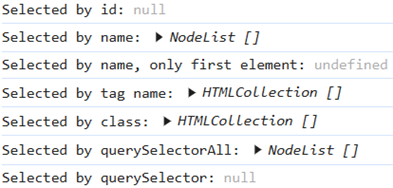
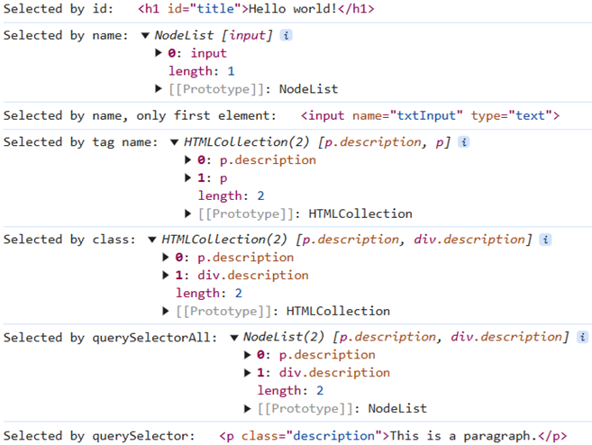
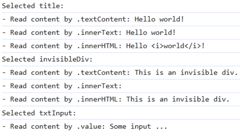
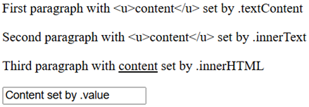

# Frontend scripting with Javascript

> 🌐 Supporting learning material
>
> Javascript book: Ferguson, R. (2019). Beginning JavaScript: The Ultimate Guide to Modern JavaScript Development. [Link](https://limo.libis.be/primo-explore/fulldisplay?docid=TN_springer_s978-1-4842-4395-4_313453&context=PC&vid=VIVES_KATHO&search_scope=ALL_CONTENT&tab=all_content_tab&lang=nl_BE:) (you must first log in via [ limo](http://limo.libis.be/index.html#/vives) before you can use this link)
>
> Developer webpage: [Mozilla](https://developer.mozilla.org/en-US/docs/Web/JavaScript)
>
> LinkedIn Learning Course: [Learning the Javascript Language](https://www.linkedin.com/learning/learning-the-javascript-language-2/)
> 
> LinkedIn Learning Course: [Validating and processing Forms with Javascript - chapters 1-3](https://www.linkedin.com/learning/validating-and-processing-forms-with-javascript-and-php)


**JavaScript** (JS) is a lightweight, interpreted programming language with top-notch features. Although best known as the web page scripting language, it is also used by many non-browser environments, such as node.js.

The standard for JavaScript is ECMAScript. As of 2012, all modern browsers fully support ECMAScript 5.1. On June 17, 2015, ECMA International released the sixth major version of ECMAScript, officially called ECMAScript 2015, and more commonly referred to as ECMAScript 2015 or ES2015. Since then, the ECMAScript standards have been released on an annual basis.

Don't confuse JavaScript with the Java programming language. Both "Java" and "JavaScript" are trademarks or registered trademarks of Oracle in the US and other countries. In contrast, the two programming languages ​​have very different syntax, semantics, and applications.

Javascript allows web pages to be made more interactive by accessing and modifying the content and layout of a web page while the page is being viewed in the browser. i.e. Javascript allows you to make a web page **dynamic** so that it responds to what the user does. Every action that needs to be done takes place via a **script** and is processed by the browser, so on the **client-side**.

## Troubleshooting

When we write code it is usually by trial and error. Making mistakes is part of the coding proces.
We distinguish two types of errors:

* **Syntax errors**: These are errors where the Javascript syntax is not correct. Usually these are typos or bits we forgot.
* **Logic errors**: Here the syntax of Javascript is correct but the result is not what we expected or intended. The fault lies in the logic of our program, which is more difficult to figure out.

Fortunately, our browser has a development environment that can help us with this. For Google Chrome you open this via `F12` and in Safari you can open this via the `Develop > Show Web Inspector` menu.

You can log values ​​of variables to the console to try and find logic errors.

```js
console.log('Result : ' + total);
```

Sometimes the error is a bit more complex and we need to debug.
Have a look at the information on the [developer page of Chrome](https://developer.chrome.com/docs/devtools/javascript/)

## Become familiar with the syntax

First of all you need to understand that javascript is interpreted line by line by the browser. While with c++ you compile the program into machine language instructions and then let it run independently.

### Add javascript to your html page.

You can choose to add a script block to your html page. If possible, avoid this technique.

```html
<head>
    <script defer type="text/javascript">
        // here goes the java code
    </script>
</head>
```
Or you can work with a separate file, which is preferable.

```html
<head>
    <script defer src="/scripts/script.js"></script>
</head>
```

By using the attribute `defer` the browser will wait for the DOM to be loaded before loading the script. This can be imported for users with slow internet connection.

::: tip 💡Tip
* Create a 'scripts' folder in your project folder in which you place the Javascript files.
* If you use other javascripts in your javascript, you must place these script links before yours.
:::

### Variables

In javascript, variables are **loosely typed**, which means that the data type depends on what you put in the variable. So you can perfectly have an integer in a variable one moment and have a string in that same variable a few moments later. A variable is declared by keyword `var`, `let` or `const`.

**let**
```js
let y = 13
```
Let is a variable definition that is valid only within the block scope `{}` in which it is defined.

**var**
```js
var y = 12
```
Var is a general variable definition, so if you define it within a function, the function is the scope of the variable, if you place it at the top, the entire script file becomes the scope.

**const**
```js
const y = 11
```
Const is the definition of a constant, has the same scope as let but you cannot change the value.

::: warning ❗Attention
If you define a variable without let, var or const then it is automatically a global variable. Then you must pay attention not to define a variable with the same name anywhere else.

To avoid accidentally forgetting let, var or const you can add `"use strict";` at the top of your script file. Then you will get an error message if you forget.
:::

🔥 **Variable Naming Rules**

1. The name must start with a letter, a `$` or a `_`. Never with a number!
2. The name can contain letters, numbers, a `$` or a `_`. Never a `-` or `.`!
3. You cannot use words that have a script meaning (eg var).
4. The name is case sensitive, you always start it with a lowercase letter. You never reuse a variable name with a different capital combination.
5. Use a name that describes its information content.
6. If a name consists of several words, use a capital letter  for the second and next word(s) (eg firstName), also called **lowerCamelCase**.

### Data types

Within javascript 7 primitive data types are used:
* **Boolean**: true or false
* **Number**: integer or float
* **BigInt**: an integer with unlimited size, recognizable by a small n after the number e.g. `23232n`
* **String**: text
* **Undefined**: the data type is not yet defined eg `let a;`
* **Null**: to indicate a special value 'null'
* **Symbol**: each instance is unique, eg `Symbol("description");`

In addition, you have the **object** type that can be used to store a collection of values.
```js
let obj = {name: 'Samira', age : 25};
```
There are 4 more special object types:
* **Function**
* **Array**
* **Date**
* **RegExp**

### Logical operators

We can use the well-known logical operators in javascript to build conditions:

* `&&` the AND operator
* `||` the OR operator
* `!` the NOT operator

What is special about the interpretation of conditions is that javascript looks at the condition until the outcome has been determined with certainty, the rest of the condition is no longer interpreted at that time.
```js
false && (a=2) // left part is false, so the condition is false, a=2 will not be executed anymore.
```

Note: 

The `===` operator is known as the **strict equality operator**. It is used to compare two values to see if they are exactly the same in **both type and value**. This operator only returns `true` if both the values and types match perfectly. It is recommended to use `===` as much as possible to avoid unexpected results caused by type conversions.

The `==` operator, also known as the **loose equality operator**, also exists in JavaScript. This operator compares two values to see if they are equal **in value**, but it does not require them to be of the same type. If the values are different types, `==` will attempt to convert them to a common type before comparing, which can lead to unexpected outcomes.

### Decisions

We can use the usual decision trees in javascript:

```js
if(...){
  // code
}
else if(...){
  // code
}
else {
  // code
}

switch(answer){
  case "YES":
    // code
    break;
  default:
    // code
    break;
}
```
We also have the ternary operator:
```js
(animal === 'cat') ? console.log("cat") : console.log("no cat");
```

### Loops

We can also work with loops in Javascript:

```js
// for loop
for (let i=0; i<10; i++){}

// for-of loop
let names = ['Pete','John','Pol'];
for (let name of names) {
   console.log(name);
};

// for-in loop
let names = {n1:'Pete',n2:'John',n3:'Pol'};
for (let i in names) {
   if(names.hasOwnProperty(i)) console.log(names[i]);
};

// forEach loop
let names = ['Pete','John','Pol'];
names.forEach(function(name) {
    console.log(name);
});

// while loop
let count = 5;
while (count > 0){
  console.log(count);
  count--;
}

//do-while loop
let count = 5;
do {
  console.log(count);
  count--;
} while (count > 0);
```

### Functions

We can also work with functions and methods (see further) in JavaScript:
```js
function isEven(n) {
    return ((n % 2) === 0);
}

// call the function
let even = isEven(10);
```
In addition, we can also work with parameters here:
```js
// function with default parameters
function sayMessage(message, times) {
    times = (typeof(times) !== undefined) ? times : 10;
    
    if (typeof(message) === "string") {
        for (let i = 0; i < times; i++) {
            console.log(message);
        }
    }
}

sayMessage("Hello");
sayMessage("Hello", 5);

// function with the number of parameters of your choice, parameters go into the array 'arguments'
function sayMessages() {
    for (let i = 0; i < arguments.length; i++) {
        console.log(arguments[i]);
    }
}

sayMessages();
sayMessages("Hi");
sayMessages("Hi", "there");
// ...
```
Passing parameters works on the principle of **pass by value**, i.e. the value of temporary is copied to a local variable. However, this is not the case for reference variables such as an object (or an array). There the principle of **pass by reference** applies and there is a temporary variable that refers to the original.

```js
// pass by value example
let message = "hi";

function changeMessage(message) {
    message = "test";
}

changeMessage(message);
console.log(message); // the result is "hi"

// pass by reference example
let obj = { msg: "hi" };

function changeMessage(message) {
    message.msg = "test";
}

changeMessage(obj);
console.log(obj.msg); // the result is "test"
```

You can also be creative with functions:

```js
// a function as a variable
let sayMessage = function (message) {
    console.log(message);
}

// pass a function as a parameter
window.setTimeout(sayMessage, 5000, "Hi");

// a function as part of an object (= a method)
let obj = {
    f: function (message) {
        console.log(message);
    }
};
obj.f("Hi");

let numbers = [1, 2, 3, 4, 5];
// an anonymous function (which has no name)
numbers.forEach(function (i) {
    console.log("array contains ", i);
});

// arrow function, the ()'s can be omitted here:
double = (i) => (i * 2);
console.log(double(5));

// arrow function with multiple parameters, the () is now mandatory
// the function has also a more complex body, so we use {}
const multiply = (a, b) => {
    const result = a * b;
    return result;
};
console.log(multiply(3, 4));
```
A function that is passed as a parameter to another function is called a **callback function**.

### Error handling

Just like in a lot of other programming languages, you can provide the error handling with `try` and `catch`:

```js
try {
  // here goes the code you want to run
} catch(e){
  console.warn(e); // if an error occurs it will be sent to the console.
}
```

### Comments

As always, it's good practice to comment your code.

```js
/**
  * A block of comments
  * across multiple lines
  */

// Comment on 1 single line.
```

### Browser objects

At the top level is the **browser object model** with information from the current browser window or tab.


A level lower you can find the **document object model** with information about the DOM structure of the page.


In the next sections, we'll show examples using some DOM methods and properties to access and manipulate HTML.

### Selecting HTML elements

There are several possibilities to select elements of an HTML page in JavaScript by using `window.document.function()` (note: the `window.` can be omitted here):

* `document.getElementById()`: gets one element with a given id
* `document.getElementsByName()`: gets an array of elements with a given name
* `document.getElementsByTagName()`: gets an array of a certain type of elements
* `document.getElementsByClassName()`: gets an array of elements with a given class name
* `document.querySelectorAll()`: gets an array of elements that match a CSS selector
* `document.querySelector()`: gets a first element that satisfies a CSS selector
* `document.body`: gets the `<body>` element
* `document.documentElement`: gets the `<html>` element

Here's an example demonstrating how to select elements using the different DOM methods:

```html
<head>
    <script src="resources/js/script.js"></script>
</head>

<body>
    <h1 id="title">Hello world!</h1>
    <p class="description">This is a paragraph.</p>
    <p>Another paragraph.</p>
    <div class="description">This is a div.</div>
    <input name="txtInput" type="text">
</body>
```

```js
// in script.js:
const title = document.getElementById("title");
console.log("Selected by id:", title);

const txtInputs = document.getElementsByName("txtInput");
console.log("Selected by name:", txtInputs);
console.log("Selected by name, only first element:", txtInputs[0]);

const paragraphs = document.getElementsByTagName("p");
console.log("Selected by tag name:", paragraphs);

const descriptions = document.getElementsByClassName("description");
console.log("Selected by class:", descriptions);

const allParagraphs = document.querySelectorAll(".description");
console.log("Selected by querySelectorAll:", allParagraphs);

const firstParagraph = document.querySelector(".description");
console.log("Selected by querySelector:", firstParagraph);
```

Note: when you run this code, you'll notice in your browser's console that the values are *null*, *undefined*, an empty *HTMLCollection* array or *NodeList* array:



This is normal because the HTML page is processed by the browser from top to bottom, so the JavaScript file is loaded first and attempts to select HTML elements that have not yet been loaded.

There are several options to solve this problem.

#### Option 1: put the JavaScript file include or code at the end of the `<body>` section
   
This is the option that might first come to mind, but the problem here is that you will have to scroll all the way down through the (lengthy) HTML page to find the JavaScript code or file include.

#### Option 2: encapsulate the JavaScript code in an `addEventListener` block

We use the `DOMContentLoaded` or `load` event here:

```js
window.addEventListener("DOMContentLoaded", () => 
{
    const title = document.getElementById("title");
});
```

* `DOMContentLoaded` can be used in modern browsers. It will be executed when the HTML document has been completely loaded and parsed by the browser without waiting for stylesheets, images and other external resources to finish loading.

* `load` can be used in both old and modern browsers. It will be executed when the HTML document, including all dependent resources such as stylesheets, images and other external resources has completely loaded. This is useful when you need to ensure everything on the page is ready before running your script, particularly when the script depends on external resources.

#### Option 3: use the attribute `defer`
   
```js
<script defer src="resources/js/script.js"></script>
```

The `defer` attribute can be used in modern browsers and **works only for JavaScript file includes** (so when the `src` attribute is present). 
It indicates that the script should be executed only after the HTML document has been fully parsed (but before the *DOMContentLoaded* event is fired). It ensures that your script does not block the rendering of the HTML page and helps optimize page loading performance.
<br><br>

If you apply one of above options, you'll get now this output in the browser's console:



### Reading and writing content of an HTML element

After selecting an HTML element, you can retrieve or write content using these DOM properties:

* `.textContent`: retrieves or sets all text within an element, including hidden text. It doesn't interpret HTML tags, it treats them as plain text.

* `.innerText`: retrieves or sets the visible text within an element (i.e. it ignores text in `visibility: hidden`). It reflects the rendered text, excluding hidden content.

* `.innerHTML`: retrieves or sets the HTML structure inside an element, including any tags. It's useful for inserting or extracting HTML content with tags.

    :::danger ⛔ Security risk
    Directly setting the `.innerHTML` property of a selected element on your page with untrusted input (e.g. from an input field) can lead to **Cross-Site Scripting (XSS) attacks**. Attackers can inject malicious scripts into your webpage, which can execute when the modified content is rendered. You should at least sanitize the input before assigning it to the `.innerHTML` property.
    :::
    Additionally, setting the `.innerHTML` property with a long HTML string can make your code **harder to read and maintain**. It is better to use DOM manipulation methods (see further) to create and modify HTML elements programmatically.

* `.value`: is used for input fields (e.g. `<input>`, `<textarea>`, ...). It retrieves the user input of the field or sets a value to the field.

#### Reading content

In this example, we read the content of the elements using the DOM properties:

```html
<head>
    <style>
        #invisibleDiv {
            visibility: hidden;
            /* makes the element invisible but still takes up space <=> "display: none;" */
        }
    </style>
    <script defer src="resources/js/script.js"></script>
</head>

<body>
    <h1 id="title">Hello <i>world</i>!</h1>
    <div id="invisibleDiv">This is an invisible div.</div>
    <input id="txtInput" type="text" value="Some input ...">  
</body>
```

```js
// in script.js:
const title = document.getElementById("title");
console.log("Selected title:");
console.log("- Read content by .textContent:", title.textContent);
console.log("- Read content by .innerText:", title.innerText);
console.log("- Read content by .innerHTML:", title.innerHTML);

const invisibleDiv = document.getElementById("invisibleDiv");
console.log("Selected invisibleDiv:");
console.log("- Read content by .textContent:", invisibleDiv.textContent);
console.log("- Read content by .innerText:", invisibleDiv.innerText);
console.log("- Read content by .innerHTML:", invisibleDiv.innerHTML);

const txtInput = document.getElementById("txtInput");
console.log("Selected txtInput:");
console.log("- Read content by .value:", txtInput.value);
```

The output in the browser's console:



Notes:
* See the difference between `.innerText` and `.textContent` when an element is made invisible using CSS. The property `.innerText` will return an empty string as result.
* If the input field doesn't contain a value, the `.value` property will return an empty string.

#### Writing content

In this example, we write the content into the elements using the DOM properties:

```html
<p id="p1"></p>
<p id="p2"></p>
<p id="p3"></p>
<input id="txtInput" type="text">
```

```js
const p1 = document.getElementById("p1");
p1.textContent = "First paragraph with <u>content</u> set by .textContent";

const p2 = document.getElementById("p2");
p2.innerText = "Second paragraph with <u>content</u> set by .innerText";

const p3 = document.getElementById("p3");
p3.innerHTML = "Third paragraph with <u>content</u> set by .innerHTML";

const txtInput = document.getElementById("txtInput");
txtInput.value = "Content set by .value";
```

The output in the browser:



<br>
Note: instead of creating a separate variable to store the element selection and then applying a property to it, you can do this in a single line:

```js
const text = document.getElementById("p1").textContent; // Reading
document.getElementById("p1").textContent = "Content"; // Writing
```
However, you must ensure that `document.getElementById("p1")` is never *null* (which happens if the element is not found)! Attempting to apply a property to a *null* element will result in an error causing the rest of the code to stop executing!

#### Creating HTML elements using DOM manipulation methods

The previously discussed **properties are primarily intended for placing simple content (like text) within an element!** 

But what if you want to **dynamically add or remove HTML elements?** For that, we have **DOM manipulation methods**.

The following example will select the *div* element and then add two *p* elements below with text content and some attributes. The second *p* element will also contain an image:

```html
<div id="container"></div>
```

```js
// Step 1: Select the div element
const container = document.getElementById("container");

// Step 2: Create the first p element
const p1 = document.createElement("p");
p1.id = "p" + 1; // Set the id attribute
p1.className = "style1"; // Set the class attribute 
// Alternative syntax: p1.setAttribute("class", "style1");

p1.style.color = "red"; // Set the style attribute with a color value
// Alternative syntax: p1.style.setProperty("color", "red");

p1.textContent = "A paragraph with text."; // Add text content

// Step 3: Create the second p element
const p2 = document.createElement("p");
p2.id = "p" + 2;
p2.className = "style1 style2"; // Set multiple classes
// Alternative syntax: p2.classList.add("style1", "style2");
// With the alternative syntax, you can even add, remove or toggle class names on a dynamic way:
// p2.classList.add("style3");
// p2.classList.remove("style3");
// p2.classList.toggle("style4");

p2.textContent = "Another paragraph with text and an image.";

// Step 4: Create the img element
const img = document.createElement("img");
img.src = "resources/images/photo.jpg";
img.alt = "Some info";

// Step 5: Append the img element to the second p element
p2.appendChild(img);

// Step 6: Append the p elements to the div
container.appendChild(p1);
container.appendChild(p2);
```

After execution, following HTML code will be generated (you can see this in the *Developer Tools* of your browser below the *Elements* tab) and will also be visualized in the browser.

```html
<div id="container">
    <p id="p1" class="style1" style="color: red;">A paragraph with text.</p>
    <p id="p2" class="style1 style2">Another paragraph with text and an image.
        
    </p>
</div>
```
<br>
Typically, you will place these DOM manipulations under a specific event (e.g. clicking a button). This will be explained in the next section.

And of course, there are many more DOM manipulation methods than those demonstrated in the previous example. For a complete overview of all DOM methods and properties, check out this [reference](https://developer.mozilla.org/en-US/docs/Web/API/Document).

#### Handle events

Events are all events in a browser, e.g. the user clicks on something, an element gets the focus, ...

There are several ways to create events.

#### 1. Older technology (supported by all browsers)

Is the use of an attribute that describes the event type , which then calls a JavaScript function. This is (still) a commonly used approach, but the downside is that it is not very organized.

```html
<!-- if the focus of this element disappears then execute the function. -->
<input type="text" id="username" onblur="checkUsername();">
```

```js
function checkUsername() {
  // code...
}
```
<br>

Another approach is to link a function to an event. The downside is that you can only link one function to the event:


```html
<input type="text" id="username">
```

```js
function checkUsername() {
  // code...
}

let userName = document.getElementById("username");
userName.onblur = checkUsername; 
```
(*)

#### 2. Newer technology (only supported by modern browsers)

You can now even link multiple functions to an event. This is the preferred approach, and it will be used in this course.


```html
<input type="text" id="username">
```

```js
function checkUsername() {
  // code...
}

let userName = document.getElementById("username");
userName.addEventListener("blur", checkUsername, false);
```
(*)

<br>
An event is actually an object with properties.
For example, you can find out in the handling function who the event owner is:

```js
function checkUsername(e) {
  let target = e.target; // owner of the event.
  // code...
}

let userName = document.getElementById("username");
userName.addEventListener("blur", checkUsername, false);
```
<br>

(*) Note: how can we pass arguments to the function *checkUsername*? Use an anonymous function or use the *bind()* function. Have a look on the internet for the right syntax.

### Using objects as a kind of class

Suppose we want a class **hotel** in which we want to store the name of the hotel, the number of rooms and the number of rooms booked.
We also want a function that returns the rooms that are still available.

Then we can write a constructor for this as follows:
```js
function Hotel(name, rooms, booked) {
    this.name = name;
    this.rooms = rooms;
    this.booked = booked;
    this.checkAvailability = function () {
        return this.rooms - this.booked;
    }
}
```
and define the hotel as follows:

```js
let parkHotel = new Hotel("Park", 120, 77);
```
If we now want to have the number of rooms still available, we write:

```js
let available = parkHotel.checkAvailability();
```