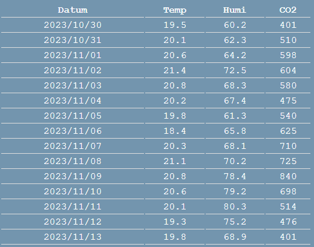
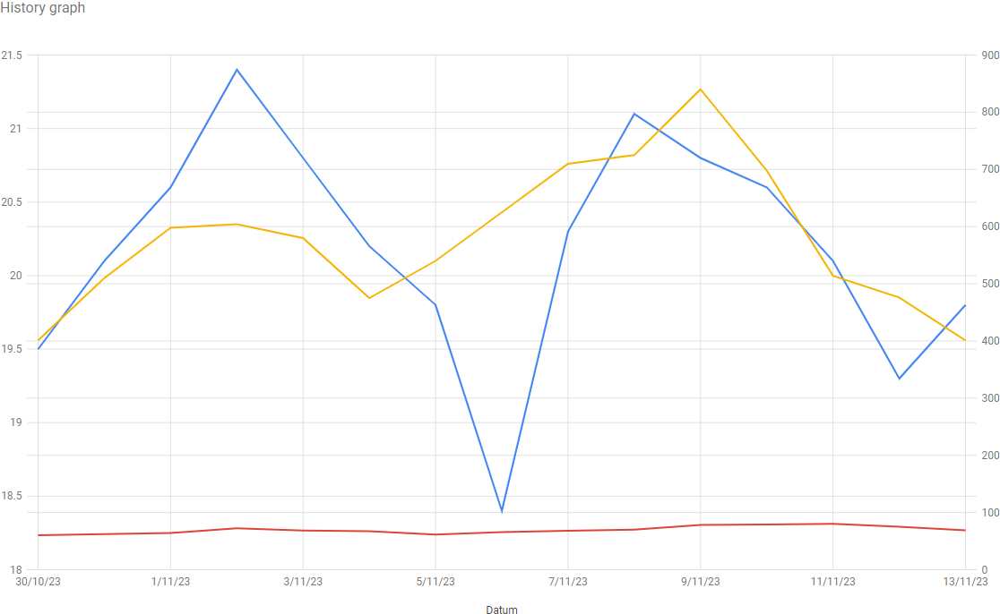

# Using API's in Javascript

An API is a service that enables a company to make data available without having access to the actual database.
It is also used as the service that links a frontend to a backend, you will learn this later on.

For now we will be using public API's. For some of them you will need to register so you get a **APIkey or token** that you can use to identify yourself with each request. Good API services always have a good documentation where you can find how you should send your request and what the JSON data scheme will be of the response.

:::warning 🔥Warning
Always look if a API service is free or behind a payment plan.
:::

## Example 1: using a public API

We will be making a webpage (no styling) with a button that receives data on your internet connection from the API `ipinfo.io` and displays it on the page.

For this we use a `index.html` file with the following content:

```html
<!DOCTYPE html>
<html lang="en">
<head>
    <meta charset="UTF-8">
    <meta http-equiv="X-UA-Compatible" content="IE=edge">
    <meta name="viewport" content="width=device-width, initial-scale=1.0">
    <title>Example 1: using a public API</title>
    <script src="resources/js/script.js"></script>
</head>
<body>
    <button id="buttonIp">Get my ip address</button>
    <p id="ip"></p>
    <p id="isp"></p>    
    <p id="coordinates"></p>
</body>
</html>
```

In JavaScript we now need a `getIp` function, this function needs to be `async` because we have to wait for the response of the API service.

To make that request we use the JavaScript `fetch` function with the URL as parameter:

```js
let response = await fetch("https://ipinfo.io/json?token=<your-token>");
```

We need the `await` because we need to wait for the response and don't want to freeze the application.
The response we get from an API is always a JSON format as a string, so to handle the data better we need to convert this to a JSON object:

```js
let ipInfo = await response.json();
```

Finally we use the received info to populate the `<p>` in HTML :

```js
window.addEventListener("DOMContentLoaded", () => 
{
    document.getElementById("buttonIp").addEventListener("click", getIp);
});

async function getIp(){
    let response = await fetch("https://ipinfo.io/json?token=<your-token>");
    let ipInfo = await response.json();
    console.log(ipInfo);
    document.getElementById("ip").textContent=`Your ip address is ${ipInfo.ip} [${ipInfo.hostname}]`;
    document.getElementById("isp").textContent=`Your internet service provider is ${ipInfo.org}`;    
    document.getElementById("coordinates").textContent=`Your local connnection has coordinates ${ipInfo.loc}`;
}
```

## Example 2: using a JSON file that represents a response from a API

For this example we will be using [these starter files](/files/startfiles_example2.zip) containing the HTML and CSS and also a JSON file containing the response data from a API.

Once the HTML structure is loaded we will start a function `getData` to retrieve the data and populate the page.

```js
window.addEventListener('DOMContentLoaded', getData);
```

To recieve the data we follow the same strategy as before, but the URL is in fact a path to a file:

```js
let response = await fetch("/resources/data/apisim.json");
let json = await response.json();
```

Next we will be converting the values of the data to an array to make it easier to iterate:

```js
let inputValues = Object.values(json.Data);
```

Before populating a table with the data we make sure no previous data is still present in the table:

```js
let tbody = document.getElementById("tableBody");
while (tbody.hasChildNodes()) {
    tbody.removeChild(tbody.firstChild);
}
```

To populate the table we will be iterating through the values:

```js
inputValues.forEach((data) => {

}
```
Now we need to append a new row with the cells containing the data:

```js
// adding a new row to the table body
let row = tbody.insertRow(-1);
// adding a new cell to the newly made row
let cell = row.insertCell(-1);
// creating a textnode containing the actual data
let datum = document.createTextNode(data.Date);
// appending the textnode to the newly made cell
cell.appendChild(datum);
```

Continue adding cells for all the data =such as temperature, humidity and CO<sub>2</sub>.

The result should look like this:



Now that the data is visible in the table, we want to visualize it also in a graph. For this we will be using **Google Chart**.

First have a look at the documentation on the [line chart from Google Chart](https://developers.google.com/chart/interactive/docs/gallery/linechart) and try this out.

Based on the example 'Creating Material Line Charts' on Google Chart we write our own script.

First we load the visualization API and the Line package and set the callback function to run when the API is loaded.

```js
google.charts.load('current', {'packages':['line']});
google.charts.setOnLoadCallback(function () {
    
});
```

In the callback function we write the following code:

```js
// create data columns
var data = new google.visualization.DataTable();
data.addColumn('date', 'Date');
data.addColumn('number', 'Temp');
data.addColumn('number', 'Humi');
data.addColumn('number', 'Co2');
// add the data in rows by iterating through the values
inputValues.forEach((dataRecord) => {
    data.addRow([new Date(dataRecord.Date), parseFloat(dataRecord.Temp), parseFloat(dataRecord.Humi), parseFloat(dataRecord.Co2)]);
});
// set the graph options
var options = {
    chart: { title: 'History graph', },
    width: '100%',
    height: 690,
    series: { 0: { axis: 'Data' } },
    hAxis: { format: 'd/M/yy', gridlines: {count: 15} },
    axes: {  y: {
        temp: { label: 'Temp (°C)' },
        humi: { label: 'Humi (%)'},
        co2: {label: 'co2 (ppm)'} } },
    legend: { position: 'none' }
};
// instantiate and draw our chart, passing in the options.
var chart = new google.charts.Line(document.getElementById('chart'));
chart.draw(data, google.charts.Line.convertOptions(options));
```

The result should look like this:



<!-- TODO :  de starterfiles nog voorzien in het engels -->

You can find the completed example [here](/files/example2.zip).