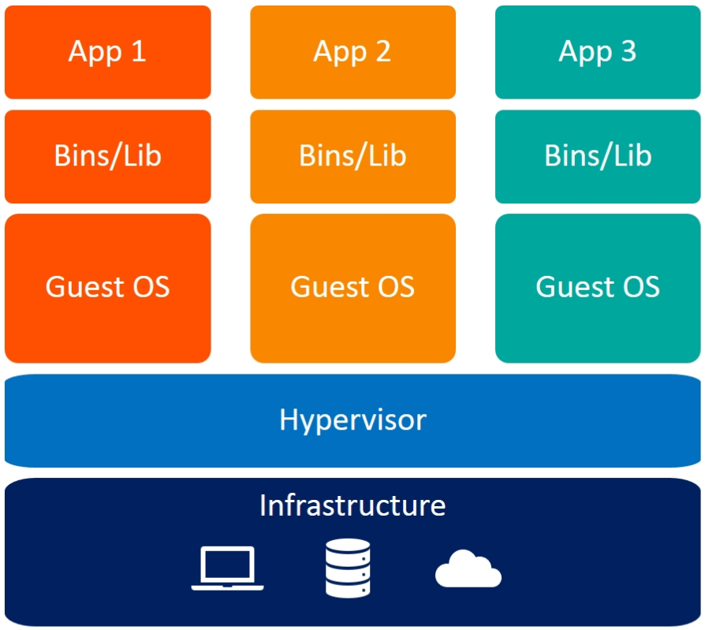
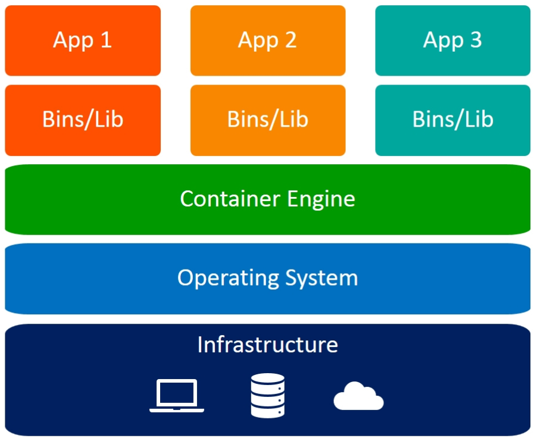

# Containers and virtual machines

## Introduction

### What is a Virtual Machine

A **virtual machine (VM)** is a full emulation of a computer system. It allows you to run an entire operating system as a guest inside another host operating system. This is made possible by a hypervisor (such as VMware, VirtualBox, or KVM) that provides the underlying virtualization layer.



Each VM includes its own:
* Operating system kernel
* File system and libraries
* Networking and system tools
* Processes, memory, and compute space

Because of this full isolation, virtual machines are very secure and flexible — they can run any OS (Linux, Windows, BSD), independent of the host system. You can use them to simulate complex systems, test different software environments, or create reproducible infrastructure snapshots.

However, VMs come with overhead:
* Each VM can use several gigabytes of RAM and disk space.
* Startup time is slow (tens of seconds to minutes).
* Managing many VMs can be resource-intensive and complex.

### What is a Container?

A **container**, in contrast, does not emulate an entire operating system. Instead, it uses the host OS kernel but provides process and file system isolation for the application it runs.



A container includes:
* Your application code
* Its dependencies (e.g. Python packages)
* Any system-level binaries or shared libraries needed by the app

But it **shares the host OS kernel**, which makes containers:
* Much faster to start (milliseconds or seconds)
* Much lighter on system resources (megabytes instead of gigabytes)
* Much easier to deploy at scale

This lightweight isolation is what makes containers ideal for building and deploying microservices — each container does one thing, and does it well.

### What is Docker?

Docker is the most widely adopted tool for working with containers. It allows developers to **package applications and all their dependencies** into a standardized, portable container image. These images can be shared with others and run on any machine that supports Docker, **ensuring consistent behavior** across environments.

By using Docker, we avoid the classic "it works on my machine" problem. We can develop an application locally and be confident that it will run exactly the same on a colleague’s laptop, a test server, or a production deployment — all because it’s wrapped inside the same image.

Before we begin working with Docker, it’s important to understand a key assumption: Docker images are Linux-based. Even if you run Docker on macOS or Windows, what’s actually happening behind the scenes is that your system is running a lightweight virtual machine running Linux, and your containers run inside that. On native Linux systems, Docker uses the host’s kernel directly, making it more lightweight and efficient. 

## Start using Docker

### Running Existing Docker Containers

To start exploring Docker, we first learn how to **run containers** from existing images. [Docker Hub](https://hub.docker.com) is a public registry that hosts thousands of pre-built container images that you can use directly.

For example, to run a simple test container:
```batch
docker run hello-world
```
This pulls a minimal image and verifies that Docker is working on your machine.

To start a simple Python container:
```batch
docker run -it python:3.12
```
This starts a Python 3.12 container in interactive mode (`-it`), giving you a Python REPL inside the container. You are now running a Linux container that has Python installed — isolated from your host system. To exit the Python interpreter and stop the container, simply type `exit()`.

Other essential Docker commands you'll frequently use:

* `docker ps`: Lists running containers.
* `docker ps -a`: Lists all containers, including those that have stopped.
* `docker stop <container>`: Gracefully stops a running container.
* `docker rm <container>`: Removes a stopped container.
* `docker images`: Lists all locally stored images.

These commands help you manage the lifecycle of containers and images as you experiment and build more complex projects.

### Common Docker Run Flags

To run real-world services with Docker, you often need to pass extra options to `docker run`. These flags control how containers interact with your system, your network, and your development workflow. Below are the most commonly used flags, with a short explanation of each.

**`-d` (detached mode)**

Runs the container in the background. By default, Docker containers run in the foreground and occupy your terminal. For long-running services — such as databases, web servers, or machine learning inference APIs — you typically want to start them in detached mode so they continue running after you close your terminal or SSH session.

**`--rm` (remove after exit)**

Automatically removes the container when it exits. This prevents leftover stopped containers from piling up on your system. It's especially useful for temporary one-off jobs. If you’re running an interactive container or test script and you don’t need the container afterwards, add --rm to clean up automatically.

**`-e` (environment variables)**

Passes environment variables into the container. Containers run in isolated environments and don’t inherit variables from your host by default. You need to explicitly set each one you want to pass.

* Example: `-e POSTGRES_PASSWORD=secret` sets the environment variable `POSTGRES_PASSWORD` inside the container.

**`-p` (port mapping)**

Exposes container ports to the host machine. By default, ports inside a container are not accessible from your host. You must explicitly map them if you want to connect to the service from your browser or from another application.

* Example: `-p 8080:80` makes port 80 from inside the container accessible on port 8080 of your host.
* The format is `host_port:container_port`.

**`-v` (bind mount)**

Mounts a folder from your host system into the container’s file system. Containers are isolated by default — they do not have access to your local files. Bind mounts let you share files between the host and the container.

* Example: `-v ./data:/app/data` mounts the local folder `./data` into the path `/app/data` inside the container.
* Useful for sharing datasets, configuration files, or saving outputs.

**`--name` (assign a container name)**

Gives the container a human-readable name, which makes it easier to manage. If you don’t use this flag, Docker will generate a random name using a whimsical two-word combination (like `stoic_fermi` or `epic_pike`), which is fun but not very descriptive.

* With a name assigned, you can refer to the container using commands like `docker stop mydatabase`.

These flags are essential for developing, debugging, and deploying containerized services.

Here’s a complete example of running PostgreSQL in Docker using several of the flags we just discussed:

```batch
docker run -d \
  --rm \
  -e POSTGRES_PASSWORD=secret \
  -p 5432:5432 \
  -v ./pgdata:/var/lib/postgresql/data \
  --name my-postgres \
  postgres:17
```
This command runs PostgreSQL version 17 in the background (`-d`), and:
* **Removes the container** automatically when it stops (`--rm`)
* **Sets the database password** using an environment variable (`POSTGRES_PASSWORD`)
* **Exposes port 5432**, allowing local applications to connect to the database
* **Mounts a local folder** (`./pgdata`) into the container to persist database data
* **Assigns a name** to the container (`my-postgres`) for easier reference

This setup gives you a fully functioning PostgreSQL server running inside a container, ready for local development or testing.

### Building Custom Docker Images

Besides running existing images, you can also build your own using a **Dockerfile**. A Dockerfile is a plain-text script that describes how to construct an image — from installing dependencies to copying in your code.

Let’s start with a basic example that serves a Python FastAPI application:

```docker
FROM python:3.12-slim

WORKDIR /app

COPY requirements.txt .
RUN pip install -r requirements.txt

# copy source code
COPY . .

CMD ["fastapi", "run", "main.py"]
```

You can build this image with the following command:
```batch
docker build -t mlservice:1.0 .
```
This creates a Docker image called `mlservice` with the tag `1.0`. You can now run it just like any other image.

Let’s now break down the most important instructions in a Dockerfile:

**FROM**

This sets the base image. Every Docker image is based on another image — typically one that provides a minimal Linux system with some preinstalled tools. In this case, `python:3.12-slim` gives you a lightweight Debian image with Python 3.12 preinstalled.

**WORKDIR**

This sets the working directory inside the image. Any commands that follow (like `COPY` or `RUN`) will use this directory as their base. This helps you avoid writing long absolute paths in each line.

**COPY**

This copies files from your host machine into the image.

* `COPY requirements.txt .` copies the `requirements.txt` file into the working directory (`/app`).
* `COPY . .` copies all source code from the current directory into `/app`.

**RUN**

Executes a command inside the image while it’s being built. Here we use it to install Python dependencies from `requirements.txt` using `pip`. These commands are cached as build layers — meaning Docker will skip them on future builds if the inputs haven’t changed.

**CMD**

This sets the default command that runs when a container is started from the image. Here, we tell Docker to start the FastAPI service using `fastapi run main.py`.

The `CMD` instruction takes a list format (`["command", "arg1", "arg2"]`) to avoid relying on a shell. This is more predictable and cross-platform.

These five instructions — `FROM`, `WORKDIR`, `COPY`, `RUN`, and `CMD` — are the foundation of most Dockerfiles. With just these, you can build and run production-grade container images for your projects.

### Understanding Images and Containers

A **Docker image** is a static, read-only snapshot that defines what files and programs exist inside a container. It is built once and can be reused many times.

A **Docker container** is a running instance of an image — it's a live process that uses the image as its root filesystem. Containers are isolated from your host system and from each other unless you explicitly allow communication.

Each time you run an image, Docker creates a new container with a temporary writable layer. When the container is stopped and removed, changes made inside it are lost unless you persist data via mounts.

### Why You Should Not Use latest

One of Docker’s biggest advantages is reproducibility. Once an image is built and pushed to a registry, anyone can pull and run the exact same environment.

But reproducibility only works if you **avoid using floating tags** like `latest`.

For example, if your Dockerfile starts with:
```docker
FROM python:latest
```
Then every time you build the image, it may use a different Python version — leading to inconsistencies and subtle bugs.

Instead, always use pinned versions:
```docker
FROM python:3.12
```
The same advice applies to your packages. By pinning both your Docker base image and your dependencies, you ensure that:

* Your builds are consistent across time and machines
* Bugs are easier to reproduce and fix
* Deployments are safer and more predictable

## Container orchestration

### Introduction

We explored how to build and run individual Docker containers using off-the-shelf images from public registries or custom-built images defined via Dockerfiles. This works well for isolated, single-purpose tasks, but quickly breaks down when building real-world applications.

In real-world production systems, multiple containers often need to work together to support the full workflow. A typical deployment might include:

* A **database** to store user inputs (e.g. MySQL or MariaDB)
* A **backend** to provide interaction to the database and/or the filesystem (e.g. Express.js)
* A **frontend** for interacting with users (e.g. Vue.js)

The challenge is no longer just “how do I run one container,” but “how do I run and manage a group of containers that work together?”

Each of these components may run in a separate container. To run them reliably, they need to be started in the right order, connected over a shared network, configured via environment variables, and sometimes assigned persistent storage. If any component crashes, it may need to be restarted automatically. And when running in production, you may want to scale some services across multiple replicas or even multiple machines.

This problem — managing a group of related containers as a single system — is the domain of **container orchestration**.

Two tools are commonly used for this purpose:

* **Docker Compose**, a developer-friendly orchestration tool for local or single-node setups.
* **Kubernetes**, a production-grade orchestration platform for distributed, scalable environments.

In this course we will be concentrating on Docker Compose.

### Docker Compose a lightweight, Local orchestration

**Docker Compose** is a developer-friendly tool that allows you to define and run multi-container applications using a simple YAML configuration file. It was created to help teams manage small to medium-sized projects locally or on single-node servers.

To understand Docker Compose more concretely, let’s look at a minimal example that captures a common web development architecture.

This project includes:
* A **frontend**, built with Vue.js
* A **backend**, written in Express.js and exposing a REST API
* A MySQL **database** for persistent data storage

This is not a fully runnable example — it references placeholder image names like `my-frontend` and assumes a `./backend` folder containing a Dockerfile — but it illustrates the basic structure and syntax of a Compose file.

```yaml
services:
  frontend:
    image: my-vue-frontend:1.0
    ports:
      - "8000:8000"
    depends_on:
      - backend

  backend:
    build:
      context: ./backend
    ports:
      - "3000:3000"
    environment:
      - DB_HOST=db
      - DB_USER=root
      - DB_PASSWORD=${MYSQL_ROOT_PASSWORD}
      - DB_NAME=appdb
    depends_on:
      - db

  db:
    image: mysql:8.0
    environment:
      - MYSQL_ROOT_PASSWORD=${MYSQL_ROOT_PASSWORD}
      - MYSQL_DATABASE=appdb
    volumes:
      - mysqldata:/var/lib/mysql

volumes:
  mysqldata:
```

Let’s break down what this file does:
* The **frontend** runs from a pre-built image and is exposed to port `8000` on the host. It depends on the backend being available first.
* The **backend** is built from a local `./backend` folder(which must include a Dockerfile) and and connects to the database using environment variables. It exposes a REST API on port `3000`.
* The **db** uses the official MySQL image, initializes the database with a root password and name, and stores its data in a persistent volume (`mysqldata`).

All services share a private internal network and can communicate with each other using their service names (`frontend`, `backend`, `db`). Only the frontend and backend are exposed to the host machine.

You can start this system with a single command:
```batch
docker compose up
```

#### Core Docker Compose Commands

Here are the most useful Docker Compose commands you’ll use:

* `docker compose up` Starts all services, building any required images if necessary.
* `docker compose up -d` Starts all services in detached mode, so they run in the background.
* `docker compose up --build` Forces a rebuild of any services with local Dockerfiles, even if the Dockerfile hasn’t changed. This is useful when you’ve modified the base image or source code.
* `docker compose down` Stops and removes all services and networks defined in your Compose file.
* `docker compose build` Builds any services that are defined using a build: context.
* `docker compose ps` Lists all running containers in the current Compose project.
* `docker compose logs` Shows the logs from all services.
* `docker compose logs -f backend` Follows the live logs of a specific service, such as the backend.

These commands are all you need to manage, debug, and iterate on your Compose applications.

#### Managing Images and Builds

Docker Compose supports two main ways to launch a service: using pre-built images or building images locally from source.

**Using a pre-built image**

This is the simplest and most common option. If you already have a container image available on Docker Hub or another registry, you can reference it using the image: directive.

```yaml
services:
  frontend:
    image: registry.example.com/my-frontend:1.0
```

Compose will pull the image if it’s not available locally and then start the container.

**Building a local image**

If you're actively developing a service — like a backend model server — you typically want to build the container from your local code using a `Dockerfile`.

```yaml
services:
  backend:
    build:
      context: ./backend
```

Here, `./backend` is a folder that contains a `Dockerfile`. Docker Compose will use this as the build context, create an image, and then start a container from it.

To ensure your local image gets rebuilt, use:

```batch
docker compose up --build
```

This forces Docker to rebuild the image even if the Dockerfile hasn't changed, which is useful when you've modified source code or base images.

#### Networking and Inter-Service Communication

One of Docker Compose's most powerful features is its built-in networking model. When you run `docker compose up`, Docker automatically creates a private network and connects all the defined services to it. This allows containers to communicate with each other using simple hostnames — specifically, their service names.

**Internal communication by service name**

Each service in a Compose file is assigned a DNS name equal to its service name. This means that services can talk to each other using those names, without needing to know the container's IP address.

For example, if your `backend` service wants to connect to your `db` service, you can use the hostname `db`:

```yaml
backend:
    build:
      context: ./backend
      environment:
        - DB_HOST=db

    db:
    image: mysql:8.0  
```

Here, the backend can reach the mysql server using the hostname `db`, which resolves to the internal IP address of the database container on the Docker network.

This is much simpler than managing IP addresses manually, and ensures that everything will still work even if Docker reassigns container IPs when restarting.

**Exposing ports to the outside world**

By default, services are only accessible from within the Docker Compose network. If you want to access a service from outside (e.g. from your browser or Postman), you need to explicitly publish its ports using the `ports:` directive.

```yaml
services:
  frontend:
    image: my-vue-frontend:1.0
    ports:
      - "8000:8000"
    
  backend:
    build:
      context: ./backend
    ports:
      - "3000:3000"
```

This configuration maps:

* Port `8000` in the `frontend` container to port `8000` on your host
* Port `3000` in the `backend` container to port `3000` on your host

**Security benefits of limiting port exposure**

Not every service should be accessible from outside the Docker network. For example, a database should typically only be accessed by your backend — not by external users or applications. In Docker Compose, you simply omit the `ports:` section to keep a service internal:

```yaml
db:
    image: mysql:8.0
    environment:
      - MYSQL_ROOT_PASSWORD=${MYSQL_ROOT_PASSWORD}
      - MYSQL_DATABASE=appdb
```

This makes the database reachable by the `backend` (which can connect to `db:3306`), but not by anything outside the Docker environment. If you tried to connect from your laptop to `localhost:3306` or `<ip-adress-of-your-vm>:3306`, it would fail — because the port is not published.

This design improves security by reducing the system's attack surface. Only the services that need to be public are made public, and everything else stays internal.

#### Volumes and Persistence

When working with Docker Compose, it's important to understand what happens to your containers and their data over time. By default, containers created with `docker compose up` are **ephemeral** — meaning they are rebuilt from scratch every time you recreate them.

If you run:

```batch
docker compose down
```

Docker Compose removes all running containers, along with their internal data. The next time you run `docker compose up`, even if the image is unchanged, Docker will create new containers from scratch. This behavior is fine for stateless services like frontend servers or APIs, but it becomes a problem when dealing with **stateful services**, such as databases or caching layers, which need to preserve data across runs.

To retain data between container restarts, you must use some form of **persistent storage**. Docker Compose offers two main options: **bind mounts** and **named volumes**.

**Bind mounts**

A bind mount maps a folder on your host machine into the container. This is useful when you want to directly share files between your system and the container — for example, to make code or data available in both environments.

```yaml
services:
  notebook:
    image: jupyter/scipy-notebook
    ports:
      - "8888:8888"
    volumes:
      - ./notebooks:/home/jovyan/work
```

In this example, the `./notebooks` folder on your host is mounted inside the container at `/home/jovyan/work`. Any changes made in the notebook interface are saved directly to your host file system.

Bind mounts are easy to use and great for development, but they come with a few drawbacks:
* File permission issues can arise, especially on Windows or when the container runs as a different user.
* The container depends on the structure and presence of files on the host machine.
* They are not portable — the Compose file may break on another computer if the paths don’t exist.

**Named volumes**

A named volume is a Docker-managed storage location that exists independently of your host file system. Named volumes are ideal for production use, or anytime you want Docker to manage persistence automatically.

```yaml
services:
  db:
    image: mysql:8.0
    environment:
      - MYSQL_ROOT_PASSWORD=${MYSQL_ROOT_PASSWORD}
      - MYSQL_DATABASE=appdb
    volumes:
      - mysqldata:/var/lib/mysql

volumes:
  mysqldata:
```

This configuration creates a named volume called `mysqldata`. Docker Compose ensures that this volume persists across container restarts — even if you run `docker compose down` and `up` again, the database files will still be there.

Compared to bind mounts, named volumes are:
* Easier to manage and more portable between systems
* Isolated from the host’s file system structure
* Less prone to permission problems
* Automatically created and cleaned up by Docker when you remove the project

**When to use persistence**

* Use **bind mounts** when developing code, editing notebooks, or needing to sync files between host and container.
* Use **named volumes** when storing persistent application data such as databases, caches, or logs that shouldn’t be tied to a specific file path on the host.

Understanding the difference between bind mounts and volumes is essential when building robust, multi-service environments. If your project includes a database, object storage layer, or experiment tracker, always think about how and where the data should be persisted. Docker Compose gives you the flexibility to choose the approach that fits your workflow.

#### Environment Variables and Configuration

Environment variables are a common convention across containerized applications. Many public Docker images — such as `mysql`, `redis` or `nginx` — support **configuration via environment variables** out of the box. It’s essential to consult the image documentation to know which variables are supported.

Likewise, if you write your own services (in Python, Go, Node.js, etc.), it’s a good practice to make your configuration parameters configurable via environment variables. This enables reproducible deployments, easier testing, and compatibility with Compose, Kubernetes, and CI/CD pipelines.

In Docker Compose, environment variables are **not inherited** from your host machine by default. This means that if you have a variable set in your terminal (on Linux, macOS, or Windows), it won’t automatically be visible inside your containers. You must explicitly pass them into the container using one of several supported mechanisms.

Let’s walk through the three most common ways to define environment variables in Docker Compose.

**Inline environment variables in the Compose file**

This is the simplest option. You define the environment variables directly under the `environment:` section of a service. This approach is convenient for fixed or default values that don't change across environments.

```yaml
services:
  frontend:
    image: my-frontend
    environment:
      - DEBUG=true
      - MAX_WIDTH=1000
      - NAME=example.com
```

This configuration sets three variables that will be available to the frontend container. Inline variables are straightforward, but they hardcode values into the Compose file — which is not ideal for secrets or values that vary between deployments.

**Variable substitution using a `.env` file**

Another approach is to define your environment variables in a separate `.env` file. Docker Compose automatically loads this file and allows you to reference its contents inside the Compose YAML using `${VARIABLE_NAME}` syntax.

Example `.env` file:

```ini
BACKEND_PORT=8000
DEBUG=true
DATABASE_URL=postgresql://user:${PASSWORD}@db:5432/appdb
```

Compose file using variable substitution:

```yaml
services:
  backend:
    build:
      context: ./backend
    ports:
      - "${BACKEND_PORT}:${BACKEND_PORT}"
    environment:
      - DEBUG=${DEBUG}
      - DATABASE_URL=${DATABASE_URL}
```

This technique is useful when you want your configuration to be customizable by each user or deployment environment. The `.env` file is typically included in `.gitignore`, and teams may provide a `.env.example` file to illustrate the required settings.

**Loading all variables from a file into a service**

If you have a large number of environment variables — for example, service-specific secrets or third-party credentials — you can load them all from a dedicated file using the `env_file:` directive.

```yaml
services:
  backend:
    build:
      context: ./backend
    env_file:
      - secrets.env
```

Example secrets.env file:

```ini
SECRET_KEY=supersecretvalue
JWT_ISSUER=https://my-app.com
TOKEN_EXPIRATION=3600
```

This approach is especially helpful for isolating secret configuration from public project settings. In production, secret files are often injected dynamically through CI/CD pipelines or mounted as volumes from secure storage, rather than being committed to version control.

#### Service Lifecycle and Restart Behavior

When using Docker Compose to run long-lived services — such as APIs, model servers, dashboards, or databases — it’s important to understand how these services behave over time, especially in the face of crashes or system reboots.

By default, **Docker Compose does not keep your services running** if something goes wrong. If a service crashes or your machine reboots, the container will not restart automatically. This is because the default restart policy is `no`.

For production scenarios or any setup where uptime matters, this default behavior is rarely what you want. Let's explore how to manage service lifecycle more explicitly using **restart policies**.

**Why restart policies matter**

Restart policies determine how the Docker engine reacts when a container stops. Without one, containers are treated as disposable: they run once, and if they exit — whether due to an error or a system shutdown — they simply stay stopped.

If you're running backend services, dashboards, or databases as part of your Docker Compose setup, you likely want them to behave more like daemons: **always running**, even if the host machine restarts or the process crashes.

This is where restart policies come in. They tell Docker Compose to automatically bring containers back online in various scenarios.

**Common restart policy options**

Docker supports several restart policies, which can be set per service in your Compose file:

```yaml
services:
  backend:
    build:
      context: ./backend
    restart: always
```

Here’s what the available options mean:
* `no` (default): Do not restart the container automatically. This is safe for short-lived tasks, one-off scripts, or development experiments — but unsuitable for anything that should remain available.
* `always`: Restart the container if it ever stops. This includes normal failures as well as system reboots. Ideal for services that should be running 24/7, like model APIs or dashboards.
* `unless-stopped`: Restart the container like `always`, **except** if you manually stop it. This is useful if you want services to persist across reboots but still retain the ability to shut them down manually (e.g. with `docker compose stop`).
* `on-failure`: Only restart the container if it exits with a non-zero exit code — and optionally, up to a certain number of retries. This is more relevant for short-lived jobs or batch tasks.

