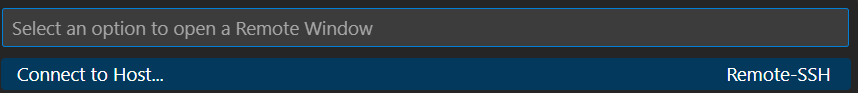

# Deploy a HTML,CSS & JS project

:::warning 🔥warning
Make sure you have prepared your VM before continuing here.
:::

## Prepare your project for deployment

To be able to deploy our website on the VM we need to prepare it.

:::tip 💡tip
Please check if all your URL's are relative (HTML and CSS)
:::

### Create a GitHub repository for deployment

* create a new repository on github
* create a local folder `<projectname>` with a subfolder `website`
* make a copy of your project to the folder `website`
* open the folder `<projectname>` in Visual Code and open a terminal
* make it a git repository by typing `git init`.
* add the remote GitHub repository by typing `git remote add origin git@github.com:yourusername/repositoryname.git` (the last part is your SSH link from your GitHub repository)
* make a first push 

### Create a docker-compose file

We will be deploying our website in a docker container, so the first thing we need to do is make a docker-compose file containing the information of how to deploy this project.

Create a file `docker-compose.yml` in the folder  `<projectname>` with the following content:

``` yaml
version: '3'
services:
  httpd:
    image: httpd:latest
    ports:
      - "80:80"
    volumes:
      - ./website:/usr/local/apache2/htdocs
    restart: always
```
* `version: '3'` specifies that Docker Compose version 3 is being used. This setting seems to be optional with newer Docker versions ...
* `httpd:` refers to the Apache HTTP Server, which is defined here as a service.
* `services:` indicates that the following configuration describes the services to be deployed by Docker Compose.
* `volumes:` maps a folder on the host machine to a folder inside the container. Here, `./website` (relative to the location of the `docker-compose.yml` file) is mapped to `/usr/local/apache2/htdocs` inside the container, which is Apache's default webroot.
* `restart: always` instructs Docker to always try to restart this service unless it was explicitly stopped by an administrator.
* `ports:`: defines the mapping between the host machine's port (external) and the container's port (internal). In this case, port 80 on the host is mapped to port 80 inside the container.

Now the preperation is ready and you can **push everyting the GitHub**.

## Clone and deploy your project in the VM

### Making a remote connection to your VM

We use the extension `ssh remote` in Visual Code to make a remote connection to your VM.

Start using a remote window by pressing the green button on the bottom left:


Now select `Connect to Host` and type `student@<Ip adress of your VM>`



Now select `Linux` as the platform:


### Clone your repository on your VM

Now you need to clone your docker repo, by using the https link of your GitHub repository.

```bash
git clone <https link repo>
```

### Deploy your website on your VM

The only thing left to do is deploying your website by starting the docker container.

* To start : `docker compose up -d`
* To stop : `docker compose down`
* To view logs : `docker compose ps`
* To view a list of the containers : `docker compose ls`

 Note: if you get an error about permissions, add `sudo` before the command.

Now everyone connected to the `devbit` network can browse to your website via `http://<ip address>`.