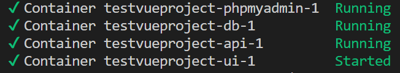

# Deploy a MySQL, Express & Vue project

:::warning 🔥warning
Make sure you have prepared your VM before continuing here.
:::

To be able to deploy our web application on the VM we need to prepare it.

## Create a GitHub repository for deployment

* create a new repository on github
* create a local folder `<projectname>` with the subfolders `db`, `api` and `vue`.
* make a copy of your **express project** to the folder `api`.
* make a copy of your **vue project** to the folder `vue`.
* open the folder `<projectname>` in Visual Code and open a terminal
* make it a git repository by typing `git init`.
* add the remote GitHub repository by typing `git remote add origin git@github.com:yourusername/repositoryname.git` (the last part is your SSH link from your GitHub repository)
* make a first push 

## Preparing the necessary files for docker

### Docker compose file

First we will be creating the docker compose file that will contain the necessary services that need to be deployed on docker ( MySQL, PHPmyAdmin, Backend-API and Frontend-Vue).

Create a file `docker-compose.yml` in the folder  `<projectname>` with the following content:

``` yaml
version: '3'
services:
  db:
    container_name: db
    image: mysql
    restart: unless-stopped
    environment:
      - MYSQL_ROOT_PASSWORD=${MYSQLDB_ROOT_PASSWORD}
      - MYSQL_DATABASE=${MYSQLDB_DATABASE}
    volumes:
      - ./db/init:/docker-entrypoint-initdb.d
      - ./db/data:/var/lib/mysql
  phpmyadmin:
    container_name: phpmyadmin
    image: phpmyadmin
    restart: unless-stopped
    ports:
      - "8080:80"
    environment:
      - PMA_ARBITRARY=1
      - PMA_HOST=db
      - PMA_USER=root
      - PMA_PASSWORD=${MYSQLDB_ROOT_PASSWORD}
    depends_on:
      - db
  api:
    container_name: api
    build:
      context: ./api
      dockerfile: Dockerfile
    restart: unless-stopped
    ports:
      - 3000:3000
    environment:
      - DB_HOST=db
      - DB_USER=${MYSQLDB_USER}
      - DB_PASS=${MYSQLDB_USER_PASS}
      - DB_NAME=${MYSQLDB_DATABASE}
      - DB_PORT=3306
      - VUE_HOST=${VUE_HOST}:5000
    depends_on:
      - db
  vue:
    container_name: vue
    build:
      context: ./vue
      dockerfile: Dockerfile
      args:
        VUE_APP_API_HOST: ${API_HOST}:3000
    restart: unless-stopped
    ports:
      - 5000:80    
    depends_on: 
      - api
``` 

Notice that the MySQL server port 3306 is not exposed, so our database is not accessable outside docker.

### Docker file for the backend API

Create a file `Dockerfile` in the folder `backend-api` with the following content:

``` yaml
# Development stage
FROM node:18.16-alpine3.17 as develop-stage
WORKDIR /app
COPY package*.json ./
RUN npm install
COPY . .

# Build stage
FROM develop-stage as build-stage
EXPOSE 3000
CMD ["npm", "run", "start"]
```

### Docker file for the frontend Vue

Create a file `Dockerfile` in the folder `frontend-vue` with the following content:

``` yaml
# Development Stage
FROM node:23-alpine AS develop-stage
WORKDIR /app
COPY package*.json ./
RUN npm install
COPY . .

# Build Stage
FROM develop-stage AS build-stage
ARG VUE_APP_API_HOST
ENV VITE_API_HOST ${VUE_APP_API_HOST}
RUN npm run build

# Production Stage
FROM nginx:1.27-alpine AS production-stage
COPY --from=build-stage /app/dist /usr/share/nginx/html
COPY nginx.conf /etc/nginx/nginx.conf
EXPOSE 80
CMD ["nginx", "-g", "daemon off;"]
```

### Hosting configuration

We are using `nginx` to host our frontend, therefore we need to configure it by adding a `nginx.conf` file in the `frontend-vue` folder with the following content:

```conf
user  nginx;
worker_processes  1;
error_log  /var/log/nginx/error.log warn;
pid        /var/run/nginx.pid;
events {
  worker_connections  1024;
}
http {
  include       /etc/nginx/mime.types;
  default_type  application/octet-stream;
  log_format  main  '$remote_addr - $remote_user [$time_local] "$request" '
                    '$status $body_bytes_sent "$http_referer" '
                    '"$http_user_agent" "$http_x_forwarded_for"';
  access_log  /var/log/nginx/access.log  main;
  sendfile        on;
  keepalive_timeout  65;
  server {
    listen       80;
    server_name  localhost;
    location / {
      root /usr/share/nginx/html;
      index  index.html;
      try_files $uri $uri/ /index.html;
    }
    error_page   500 502 503 504  /50x.html;
    location = /50x.html {
      root   /usr/share/nginx/html;
    }
  }
}
```

### CORS

In order for your Vue app to be able to call your Express API you will need to add its origin to the CORS headers in your Express app:

```js
...
import cors from 'cors';
...
const app = express()
...
var corsOptions = {
  origin: `http://${process.env.VUE_HOST}`
};
app.use(cors(corsOptions));
...
```

### Push to your GitHub repository

Now your project is ready for deployment, you can push it to GitHub.

## Clone and deploy your project

Now we will be using our GitHub repository for deployment on Docker.

### Clone your repository on docker

Make a remote connection to your VM using Visual Studio Code.

Open a terminal and clone your repository:

```bash
git clone <https link repo>
```

### Environment variables

Open your projectfolder in remote connection of Visual Studio Code.

#### Create the environment variables file

Next we need to create a ´.env´ file in the folder  `<projectname>` with the following content:

```env
# mySQL database
MYSQLDB_ROOT_PASSWORD=<your root password>
MYSQLDB_DATABASE=vives
MYSQLDB_USER=<a_user_for_your_database>
MYSQLDB_USER_PASS=<a_password_for_this_user>
API_HOST=localhost 
VUE_HOST=localhost
```

#### Change static URL to environment variable

In your Vue project you need to change all `localhost:3000` to `${import.meta.env.VITE_API_HOST}`.

Example:
```js
axios.get('http://${import.meta.env.VITE_API_HOST}/images')
```

### Prepare the database

Prepare the folder structure for the database container:
* db/
    * data/
    * init/
* ...

#### Create an initialization script

Finally, create a ´.sql´ file with the following content and place it in the `<projectname>/db/init` folder.

```sql
START TRANSACTION;

CREATE DATABASE vives;
USE vives;
CREATE USER 'webuser'@'localhost' IDENTIFIED WITH mysql_native_password BY "secretpassword";
GRANT ALL PRIVILEGES ON vives.* TO 'webuser'@'localhost';

-- Insert the content of your restore.sql file you made for your project.

COMMIT;
```

:::tip 💡tip
The user and password must be the same as you entered in your `.env` file.
:::

### Deploy on docker

Once we have done that, we are ready to build and run our service.

* use `docker-compose up -d` to deploy your container, now you get your bash prompt returned.
* use `docker-compose up -d --build` to deploy your container and rebuild them after adjustments have been made.
* use `docker-compose ps` to see the name of the containers and status.
* use `docker-compose down` to stop and remove the docker containers.
* use `docker-compose down -v` to stop and remove the docker containers and volumes.

exit

Should you want to open a terminal in one of the containers running on docker, you can do this by using this command:
```bash
docker exec -it <the name of the container> sh
```
To exit just type `exit`.


Congratulations your project should be up and running now.


